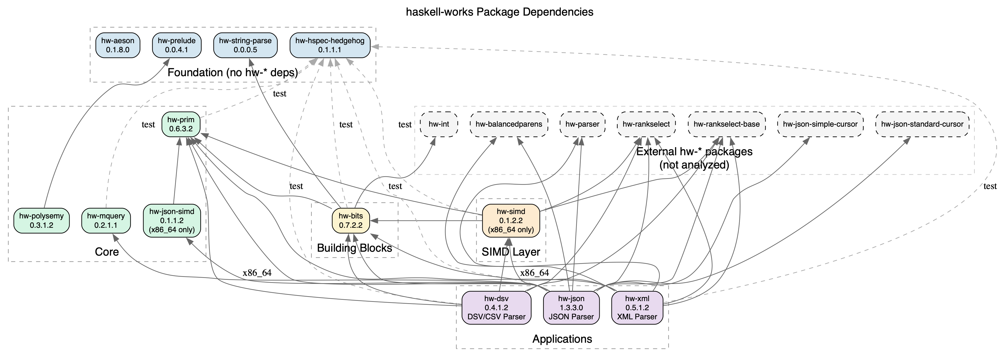

# haskell-works Package Analysis

This document provides an analysis of the `hw-*` (haskell-works) package ecosystem.

## Overview

| Package                                                                    | Version  | Description                          | License      | Analysis                                 |
|----------------------------------------------------------------------------|----------|--------------------------------------|--------------|------------------------------------------|
| [hw-aeson](https://github.com/haskell-works/hw-aeson)                      | 0.1.8.0  | Convenience functions for Aeson      | BSD-3-Clause | [Details](haskell-works/hw-aeson.md)     |
| [hw-bits](https://github.com/haskell-works/hw-bits)                        | 0.7.2.2  | Bit manipulation                     | BSD-3-Clause | [Details](haskell-works/hw-bits.md)      |
| [hw-dsv](https://github.com/haskell-works/hw-dsv)                          | 0.4.1.2  | Fast streaming DSV/CSV parser        | BSD-3-Clause | [Details](haskell-works/hw-dsv.md)       |
| [hw-hspec-hedgehog](https://github.com/haskell-works/hw-hspec-hedgehog)    | 0.1.1.1  | Hspec-Hedgehog interoperability      | BSD-3-Clause | [Details](haskell-works/hw-hspec-hedgehog.md) |
| [hw-json](https://github.com/haskell-works/hw-json)                        | 1.3.3.0  | Memory efficient JSON parser         | BSD-3-Clause | [Details](haskell-works/hw-json.md)      |
| [hw-json-simd](https://github.com/haskell-works/hw-json-simd)              | 0.1.1.2  | SIMD-based JSON semi-indexer         | BSD-3-Clause | [Details](haskell-works/hw-json-simd.md) |
| [hw-mquery](https://github.com/haskell-works/hw-mquery)                    | 0.2.1.1  | Monadic query DSL                    | BSD-3-Clause | [Details](haskell-works/hw-mquery.md)    |
| [hw-prelude](https://github.com/haskell-works/hw-prelude)                  | 0.0.4.1  | Opinionated prelude library          | Apache-2.0   | [Details](haskell-works/hw-prelude.md)   |
| [hw-prim](https://github.com/haskell-works/hw-prim)                        | 0.6.3.2  | Primitive functions and data types   | BSD-3-Clause | [Details](haskell-works/hw-prim.md)      |
| [hw-simd](https://github.com/haskell-works/hw-simd)                        | 0.1.2.2  | SIMD library                         | BSD-3-Clause | [Details](haskell-works/hw-simd.md)      |
| [hw-string-parse](https://github.com/haskell-works/hw-string-parse)        | 0.0.0.5  | String parser                        | BSD-3-Clause | [Details](haskell-works/hw-string-parse.md) |
| [hw-xml](https://github.com/haskell-works/hw-xml)                          | 0.5.1.2  | XML parser (succinct data structures)| BSD-3-Clause | [Details](haskell-works/hw-xml.md)       |

## Dependency Graph



## Inter-Project Dependencies

### Dependency Matrix

| Package              | Depends On (hw-* only)                                                                                                                                                                                          |
|----------------------|-----------------------------------------------------------------------------------------------------------------------------------------------------------------------------------------------------------------|
| **hw-aeson**         | *(none)*                                                                                                                                                                                                        |
| **hw-bits**          | hw-prim, hw-string-parse, hw-int, hw-hspec-hedgehog (test)                                                                                                                                                      |
| **hw-dsv**           | hw-bits, hw-prim, hw-simd, hw-rankselect, hw-rankselect-base, hw-hspec-hedgehog (test)                                                                                                                          |
| **hw-hspec-hedgehog**| *(none)*                                                                                                                                                                                                        |
| **hw-json**          | hw-bits, hw-prim, hw-mquery, hw-balancedparens, hw-parser, hw-rankselect, hw-rankselect-base, hw-simd (x86_64), hw-json-simd (x86_64), hw-json-simple-cursor, hw-json-standard-cursor, hw-hspec-hedgehog (test) |
| **hw-json-simd**     | hw-prim                                                                                                                                                                                                         |
| **hw-mquery**        | hw-hspec-hedgehog (test)                                                                                                                                                                                        |
| **hw-prelude**       | *(none)*                                                                                                                                                                                                        |
| **hw-prim**          | hw-hspec-hedgehog (test)                                                                                                                                                                                        |
| **hw-simd**          | hw-bits, hw-prim, hw-rankselect, hw-rankselect-base, hw-hedgehog (test), hw-hspec-hedgehog (test)                                                                                                               |
| **hw-string-parse**  | *(none)*                                                                                                                                                                                                        |
| **hw-xml**           | hw-bits, hw-prim, hw-balancedparens, hw-parser, hw-rankselect, hw-rankselect-base, hw-hspec-hedgehog (test)                                                                                                     |

### External hw-* Dependencies

These packages are referenced but are not part of this analysis:

| External Package           | Used By                          |
|----------------------------|----------------------------------|
| **hw-rankselect**          | hw-dsv, hw-json, hw-simd, hw-xml |
| **hw-rankselect-base**     | hw-dsv, hw-json, hw-simd, hw-xml |
| **hw-balancedparens**      | hw-json, hw-xml                  |
| **hw-parser**              | hw-json, hw-xml                  |
| **hw-int**                 | hw-bits                          |
| **hw-hedgehog**            | hw-simd (test)                   |
| **hw-json-simple-cursor**  | hw-json                          |
| **hw-json-standard-cursor**| hw-json                          |
| **hw-ip**                  | hw-dsv (executable only)         |

## Dependency Layers

### Layer 0 - Foundation (No hw-* dependencies)

- `hw-aeson` - Standalone Aeson utilities
- `hw-hspec-hedgehog` - Test framework bridge
- `hw-string-parse` - String parsing utilities
- `hw-prelude` - Opinionated prelude

### Layer 1 - Core (Minimal dependencies)

- `hw-prim` - Core primitives (uses hw-hspec-hedgehog for tests only)
- `hw-mquery` - Query DSL (uses hw-hspec-hedgehog for tests only)
- `hw-json-simd` - SIMD JSON indexer (depends on hw-prim)

### Layer 2 - Building Blocks

- `hw-bits` - Bit manipulation (hw-prim, hw-string-parse, hw-int)

### Layer 3 - SIMD/Performance Layer

- `hw-simd` - SIMD operations (hw-bits, hw-prim, hw-rankselect*)

### Layer 4 - Applications (High-level Parsers)

- `hw-dsv` - CSV/DSV parser (hw-bits, hw-prim, hw-simd, hw-rankselect*)
- `hw-json` - JSON parser (hw-bits, hw-prim, hw-mquery, hw-simd, hw-json-simd, hw-balancedparens*, etc.)
- `hw-xml` - XML parser (hw-bits, hw-prim, hw-balancedparens*, hw-rankselect*)

## GHC Compatibility

| Package    | Tested GHC Versions                                                       |
|------------|---------------------------------------------------------------------------|
| hw-dsv     | 9.12.2, 9.10.2, 9.8.4, 9.6.7                                              |
| hw-prim    | 9.12.1, 9.10.1, 9.8.4, 9.6.6, 9.4.8, 9.2.8, 9.0.2, 8.10.7, 8.8.4          |
| hw-json    | 9.8.2, 9.6.6                                                              |
| hw-prelude | *(not specified)*                                                         |
| Others     | Typically 9.2.2, 9.0.2, 8.10.7, 8.8.4, 8.6.5                              |

## SIMD/Performance Features

| Package         | SSE4.2 | AVX2 | BMI2 | C Sources                      |
|-----------------|--------|------|------|--------------------------------|
| hw-bits         | Yes    | -    | -    | -                              |
| hw-dsv          | Yes    | Yes  | Yes  | -                              |
| hw-json         | Yes    | -    | Yes  | -                              |
| hw-json-simd    | Yes    | Yes  | Yes  | Yes (simd*.c)                  |
| hw-prim         | Yes    | -    | -    | -                              |
| hw-simd         | Yes    | Yes  | Yes  | Yes (simd_avx2.c, simd_sse2.c) |
| hw-string-parse | Yes    | -    | -    | -                              |
| hw-xml          | Yes    | -    | -    | -                              |

**Note**: `hw-json-simd` and `hw-simd` are disabled on ARM/aarch64 architectures.

## ARM/aarch64 Portability

| Package           | ARM Status   | Blocker                    | Rust ARM Strategy                      |
|-------------------|--------------|----------------------------|----------------------------------------|
| bits-extra        | Fallback     | No BMI2 (PDEP/PEXT)        | Software emulation; no NEON equivalent |
| hw-aeson          | Works        | None                       | N/A                                    |
| hw-bits           | Works        | None                       | Pure algorithms portable               |
| hw-dsv            | Degraded     | Uses hw-simd               | NEON `vceqq_u8` for byte comparison    |
| hw-hspec-hedgehog | Works        | None                       | N/A                                    |
| hw-json           | Degraded     | Uses hw-simd, hw-json-simd | NEON for character classification      |
| hw-json-simd      | **Disabled** | `base < 0` constraint      | Rewrite C with NEON intrinsics         |
| hw-mquery         | Works        | None                       | N/A                                    |
| hw-prelude        | Works        | None                       | N/A                                    |
| hw-prim           | Works        | None                       | N/A                                    |
| hw-simd           | **Disabled** | `base < 0` constraint      | `std::arch::aarch64` NEON intrinsics   |
| hw-string-parse   | Works        | None                       | N/A                                    |
| hw-xml            | Degraded     | Uses hw-simd               | NEON for blanking/indexing             |

### x86_64 → ARM/NEON Instruction Mapping

| x86_64 Intrinsic       | ARM/NEON Equivalent    | Notes                                          |
|------------------------|------------------------|------------------------------------------------|
| `_mm256_cmpeq_epi8`    | `vceqq_u8` (128-bit)   | Process 16 bytes vs 32                         |
| `_mm256_movemask_epi8` | Manual extraction      | No direct equivalent; use `vshrn` + shifts     |
| `_pdep_u64`            | Software emulation     | No ARM equivalent; ~10-20x slower              |
| `_pext_u64`            | Software emulation     | No ARM equivalent; ~10-20x slower              |
| `_mm256_and_si256`     | `vandq_u8`             | Direct equivalent                              |
| `_mm256_or_si256`      | `vorrq_u8`             | Direct equivalent                              |
| `_mm256_set1_epi8`     | `vdupq_n_u8`           | Direct equivalent                              |

### ARM Porting Considerations

- **PDEP/PEXT**: No ARM equivalent; software fallback required (~10-20x slower)
- **Vector width**: NEON is 128-bit vs AVX2's 256-bit; process half the bytes per instruction
- **Movemask**: ARM lacks efficient horizontal bit extraction; requires multi-instruction sequence
- **Rust advantage**: `std::arch::aarch64` provides NEON intrinsics; single codebase with `cfg` guards

## High-Performance Rank/Select on ARM

The `hw-rankselect` package is critical for succinct data structures but relies on PDEP/PEXT (BMI2) for optimal performance. This section documents alternative approaches for ARM.

### Hardware Options

| Approach                | Availability              | Performance                | Notes                                    |
|-------------------------|---------------------------|----------------------------|------------------------------------------|
| ARM SVE2 BDEP/BEXT      | Optional in ARMv9         | Near-native PDEP/PEXT      | Not available on most current ARM chips  |
| ARM NEON popcount       | All ARMv8 (aarch64)       | Fast (1.8 cycles/byte)     | Via `vcnt` instruction                   |
| ARM SVE popcount        | Graviton3+, Apple M-series| 3x faster than NEON        | Limited availability                     |

**SVE2 Note**: SVE2 provides BDEP (bit deposit), BEXT (bit extract), and BGRP instructions—direct equivalents to x86 PDEP/PEXT. However, SVE2 is optional in ARMv9 and not yet widely available. All currently announced SVE2 cores only support 128-bit vectors (same as NEON).

### Software Polyfills for PDEP/PEXT

| Polyfill                | Technique                      | Performance vs Native | ARM Support           |
|-------------------------|--------------------------------|-----------------------|-----------------------|
| ZP7 (zp7)               | Parallel-prefix-popcount       | ~3-5x slower          | Portable C fallback   |
| Multiplication tricks   | Bit concentration via multiply | Mask-dependent        | Pure arithmetic       |
| Naive loop              | Bit-by-bit iteration           | ~10-20x slower        | Fully portable        |

**ZP7** ([github.com/zwegner/zp7](https://github.com/zwegner/zp7)) is a branchless PEXT/PDEP polyfill using parallel prefix algorithms. It's faster than naive loops on all architectures and can optionally use CLMUL (carryless multiply) for acceleration on x86.

**Multiplication-based PEXT**: For compile-time-known masks with few bit groups, PEXT can be emulated with multiplication:
```
pext(x, 0x8040201008040201) →
  (((x & mask) + (0x8080808080808080 - mask)) * 0x0002040810204081) >> 56
```

### Rank/Select Data Structures (No PDEP/PEXT Required)

| Structure     | Space Overhead | Rank Time | Select Time | Key Technique                              |
|---------------|----------------|-----------|-------------|--------------------------------------------|
| Rank9         | 25%            | Very fast | Moderate    | 2-level interleaved index                  |
| Rank9.v2      | 6.3%           | Fast      | Moderate    | Compressed 2-level                         |
| Poppy         | 3%             | Fast      | Fast        | 3-level with interleaving                  |
| CS-Poppy      | 3.51%          | Fast      | Fast        | Poppy + sampling for select                |
| SPIDER (2024) | 3.82%          | Best ≥8Gb | Very fast   | Interleaved metadata + ML-inspired predict |
| RRR           | Compressed     | O(1)      | O(1)        | Block-based with lookup tables             |

**SPIDER** ([arxiv.org/abs/2405.05214](https://arxiv.org/abs/2405.05214)) is state-of-the-art (2024):
- Interleaves metadata with bit vector for cache efficiency
- Uses predictions to eliminate linear scan cost in select
- 22% faster rank, 41% faster select vs previous 4% space structures

**Key insight**: Modern rank/select structures achieve high performance through cache-aware layout and prediction, not PDEP/PEXT. These techniques are architecture-independent.

### Rust Libraries for ARM Rank/Select

| Crate           | ARM Support | SIMD         | Notes                                      |
|-----------------|-------------|--------------|-------------------------------------------|
| vers-vecs       | Yes (pure)  | x86 optional | Fastest pure-Rust; no ARM-specific opts   |
| indexed-bitvec  | Yes (pure)  | None         | Based on Zhou-Andersen-Kaminsky paper     |
| succinct        | Yes (pure)  | None         | O(lg lg n) select via binary search       |
| sdsl (bindings) | Partial     | Via C++      | Wraps C++ sdsl-lite; vgteam fork for ARM  |
| rust-bio        | Yes (pure)  | None         | Bioinformatics focus; succinct rank/select|

**Recommendation**: For Rust on ARM, use **vers-vecs** which achieves competitive performance without architecture-specific SIMD. The pure-Rust implementation uses broadword techniques that work well on ARM's 64-bit registers.

### ARM Rank/Select Strategy for Rust Port

1. **Popcount**: Use `count_ones()` intrinsic (compiles to ARM `cnt` or NEON `vcnt`)
2. **Rank structure**: Implement SPIDER or Poppy—neither requires PDEP/PEXT
3. **Select structure**: Use prediction-based approach from SPIDER or sampling from CS-Poppy
4. **SIMD byte comparison**: Use NEON `vceqq_u8` for 16-byte parallel comparison
5. **Future-proof**: Add SVE2 BDEP/BEXT path with `cfg` guards for when hardware becomes available

### simdjson ARM Performance Reference

The [simdjson](https://simdjson.org/) library demonstrates ARM NEON can achieve competitive JSON parsing performance:

| Platform      | SIMD Width | Performance vs x86 AVX2 |
|---------------|------------|-------------------------|
| Apple A12     | 128-bit    | ~50-80% of Skylake      |
| Apple M1      | 128-bit    | Competitive with AVX2   |
| Graviton2/3   | 128-bit    | Near-parity with AVX2   |

The 128-bit NEON vector width (vs 256-bit AVX2) is offset by ARM's efficient instruction dispatch and lower memory latency on modern chips.

## Components Summary

| Package           | Libraries          | Executables | Test Suites | Benchmarks |
|-------------------|--------------------|-------------|-------------|------------|
| hw-aeson          | 1                  | -           | 2           | -          |
| hw-bits           | 1                  | -           | 2           | 1          |
| hw-dsv            | 1                  | 1           | 3           | 1          |
| hw-hspec-hedgehog | 1                  | -           | 2           | -          |
| hw-json           | 2 (lib + examples) | 1           | 2           | 1          |
| hw-json-simd      | 1                  | 1           | 2           | -          |
| hw-mquery         | 1                  | 1           | 2           | -          |
| hw-prelude        | 1                  | -           | -           | -          |
| hw-prim           | 1                  | -           | 2           | 1          |
| hw-simd           | 1                  | -           | 2           | 1          |
| hw-string-parse   | 1                  | -           | 2           | -          |
| hw-xml            | 1                  | 1           | 2           | 1          |

## Testing Frameworks

- **hspec** + **hedgehog** - Most packages
- **hw-hspec-hedgehog** - Bridge between hspec and hedgehog
- **doctest** - Most packages include doctest suites

## Rust Porting Assessment

| Package           | Feasibility | Priority | Notes                                                                   |
|-------------------|-------------|----------|-------------------------------------------------------------------------|
| bits-extra        | High        | High     | Direct `std::arch` equivalents for PDEP/PEXT; essential for succinct DS |
| hw-prim           | High        | High     | Foundation library; traits map well from type classes                   |
| hw-bits           | High        | High     | Pure bit manipulation; broadword/De Bruijn algorithms portable          |
| hw-simd           | High        | High     | Native SIMD via `std::arch`; no FFI overhead in Rust                    |
| hw-json-simd      | High        | High     | Clear FFI boundary; compare with simd-json approach                     |
| hw-dsv            | High        | Medium   | Unique succinct CSV approach; would differentiate from `csv` crate      |
| hw-json           | High        | Medium   | Semi-indexing approach novel in Rust; requires rank/select first        |
| hw-xml            | High        | Medium   | Succinct XML unique; depends on balanced parentheses port               |
| hw-mquery         | High        | Low      | Query DSL; iterator chains natural in Rust                              |
| hw-string-parse   | High        | Low      | Trivial (~60 LOC); `nom`/`combine` already exist                        |
| hw-aeson          | High        | Low      | Mostly covered by `serde` attributes                                    |
| hw-hspec-hedgehog | High        | Low      | `proptest` already integrates with `cargo test`                         |
| hw-prelude        | Medium      | Low      | Some utilities useful; most covered by existing crates                  |

### Recommended Porting Order

1. **bits-extra** - PDEP/PEXT primitives (required by others)
2. **hw-prim** - Core abstractions (AtIndex, Container, etc.)
3. **hw-bits** - Bit manipulation (popcount, broadword, log2)
4. **hw-simd** - SIMD byte comparison operations
5. **hw-json-simd** - SIMD JSON semi-indexer
6. **hw-dsv** / **hw-json** / **hw-xml** - Application-level parsers

### Key Rust Advantages

- **Native SIMD**: `std::arch::x86_64` provides intrinsics without FFI overhead
- **Zero-cost abstractions**: Traits compile away like Haskell type classes
- **No GC pauses**: Predictable latency for streaming parsers
- **Memory safety**: Bounds checking without runtime cost when optimized
- **Cross-platform SIMD**: Portable SIMD on nightly; ARM/NEON support possible

### Key Challenges

- **No lazy evaluation**: Must use iterators explicitly for streaming
- **No higher-kinded types**: Some abstractions require workarounds
- **Orphan rules**: Can't impl external traits on external types

## Key Observations

1. **Core foundation**: `hw-prim` is the most fundamental package, used by nearly all others

2. **Test infrastructure**: `hw-hspec-hedgehog` is widely used as a test dependency across the ecosystem

3. **Succinct data structure ecosystem**: Many packages depend on external `hw-rankselect`, `hw-rankselect-base`, and `hw-balancedparens` for succinct data structure operations

4. **Performance focus**: Heavy use of SIMD instruction sets (SSE4.2, AVX2, BMI2) with conditional compilation for optimal performance on x86_64

5. **Consistent authorship**: All packages maintained by John Ky (newhoggy@gmail.com)

6. **Modern Cabal**: Most packages use cabal-version 2.2; newer packages (hw-prelude) use 3.4
